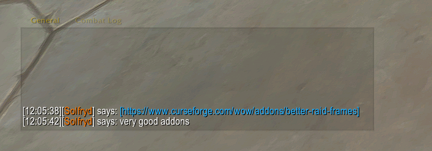

# BetterChatFrames

A World of Warcraft addon that enhances the default chat frames.

## Features

- Clickable URLs with copy popup
- Custom timestamp format (Blizzard timestamp system)
- Hide chat action bar
- Hide social icon above chat
- Hide chat tab background and border (text remains visible)
- Input box frame opacity control

## Usage

Type `/bcf` to open the configuration window.

## Installation

1. Download the latest release
2. Extract the `BetterChatFrames` folder to your `Interface/AddOns` directory

## Links

- https://www.curseforge.com/wow/addons/better-chat-frames
